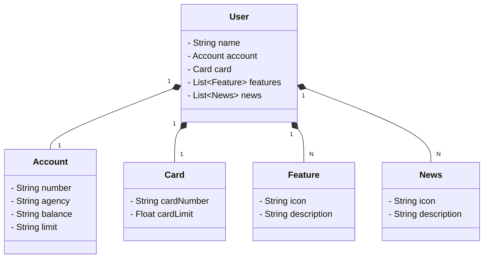

# Avanade 2025
Java RESTful API criada para o Avanade Dev Week 2025.

## Diagrama de Classes

```mermaid
classDiagram

class User {
  - String name
  - Account account
  - Card card
  - List~Feature~ features
  - List~News~ news
}

class Account {
  - String number
  - String agency
  - String balance
  - String limit
}

class Card {
  - String cardNumber
  - Float cardLimit
}

class Feature {
  - String icon
  - String description
}

class News {
  - String icon
  - String description
}

User "1" *-- "1" Account
User "1" *-- "1" Card
User "1" *-- "N" Feature
User "1" *-- "N" News

```
